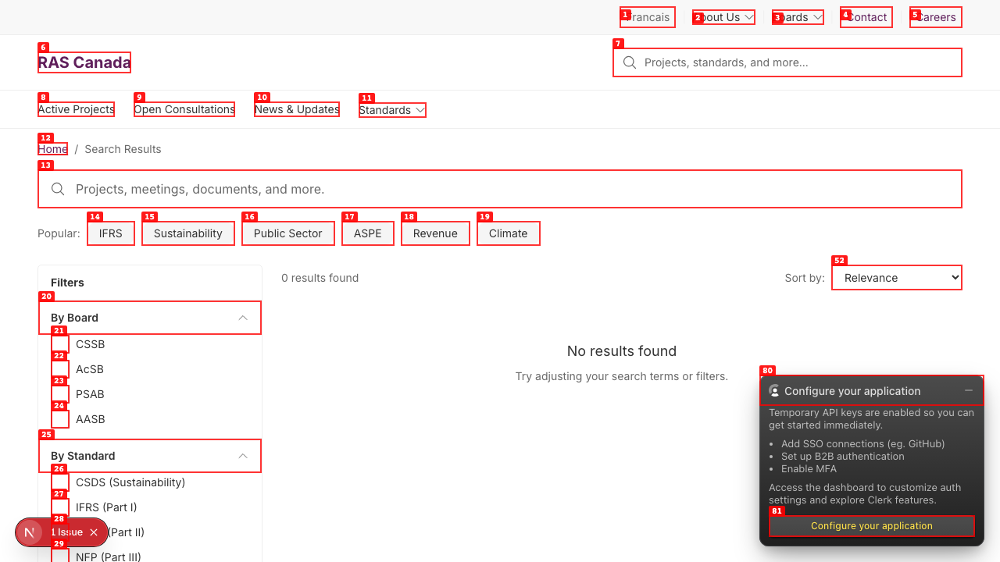
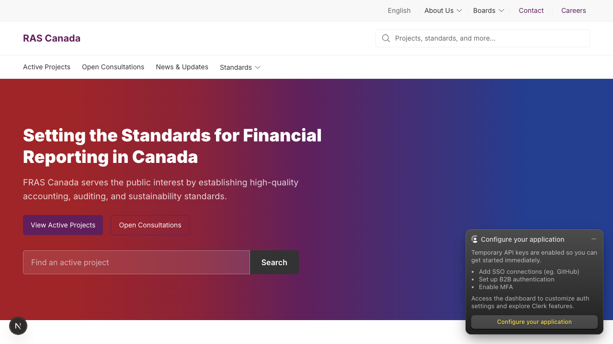

# Dogfood Report: FRAS Canada PoC — Layer 5 Verification Pass

| Field | Value |
|-------|-------|
| **Date** | 2026-05-01 |
| **App URL** | http://localhost:3000 |
| **Session** | fras-layer-5-verify |
| **Scope** | Verify this session's Layer 5 work: 5 admin-API auth fixes, WCAG 2.5.8 target-size fix on /en/search, Storybook Workbox port, /admin & /cms gates, public frontend smoke. |

## Summary

| Severity | Count |
|----------|-------|
| Critical | 0 |
| High | 1 |
| Medium | 2 |
| Low | 1 |
| **Total** | **4** |

## Verification Checklist

All recently-shipped work verified live. Six of the eight environmental checks pass; two are env-only (Meilisearch container) or content-only (legacy strings) and tracked as issues below.

| # | Check | Expected | Actual | Status |
|---|-------|----------|--------|--------|
| 1.1 | `GET /api/tree` unauthenticated | 401 | `401 {"error":"Unauthorized"}` | ✅ PASS |
| 1.2 | `GET /api/tree/search?q=x` unauthenticated | 401 | `401 {"error":"Unauthorized"}` | ✅ PASS |
| 1.3 | `GET /api/admin/schedule` unauthenticated | 401 | `401 {"error":"Unauthorized"}` | ✅ PASS |
| 1.4 | `GET /api/admin/language-audit` unauthenticated | 401 | `401 {"error":"Unauthorized"}` | ✅ PASS |
| 1.5 | `GET /api/media-folders/tree` unauthenticated | 401 | `401 {"error":"Unauthorized"}` | ✅ PASS |
| 2.1 | `/en/search` filter inputs ≥ 24×24 | 24×24 | 27/27 inputs measured 24×24 via `getBoundingClientRect` | ✅ PASS |
| 3.1 | Workbox stories in `storybook-static/index.json` | 5 stories | 5 stories + docs page (admin-view, editor-view, author-view, empty-state, mobile, docs) | ✅ PASS |
| 4.1 | `/en` homepage loads | 200 | 200, hero + nav rendered | ✅ PASS (see ISSUE-004 for content) |
| 4.2 | `/fr` homepage loads | 200, **French** content | 200, **English** content | ❌ See ISSUE-002 |
| 4.3 | `/en/active-projects` loads | 200, list rendered | 200, list rendered | ✅ PASS |
| 4.4 | `/en/open-consultations` loads | 200, list rendered | 200, list rendered | ✅ PASS |
| 4.5 | `/en/search` loads, filters render | 200, search functional | 200, filters render but search backend errors | ❌ See ISSUE-001 |
| 5.1 | `/admin` returns 200 | 200 | 200, Payload Dashboard renders | ✅ PASS |
| 5.2 | `/cms` returns 200 (or auth gate) | 200 / login redirect | 200 → `/admin/login?redirect=/cms` (auth gate working) | ✅ PASS |

## Issues

### ISSUE-001: Search page fails because Meilisearch is not running

| Field | Value |
|-------|-------|
| **Severity** | medium |
| **Category** | functional |
| **URL** | http://localhost:3000/en/search |
| **Repro Video** | N/A |

**Description**

`/en/search` renders the page chrome but the InstantSearch widgets fall through to a "No results found" empty state because the page can't reach Meilisearch on `localhost:7700`. Console shows `net::ERR_CONNECTION_REFUSED` followed by `MeiliSearchRequestError: Request to http://localhost:7700/multi-search has failed`. Search is non-functional.

This is an environment gap, not a code bug — `docker-compose.yml` defines a `meilisearch` service but only `postgres` was started this session. The `local-dev` skill or `docker compose up -d` (no service arg) would have started both.

**Repro Steps**

1. Start only Postgres: `docker compose up -d postgres`
2. Start dev server: `npm run dev`
3. Navigate to `http://localhost:3000/en/search`
4. **Observe:** "No results found" + console errors
   

**Fix:** add a startup check / friendlier error, OR document that `docker compose up -d` (all services) is the correct dev-start command.

---

### ISSUE-002: `/fr` renders English content (i18n broken on rendered pages)

| Field | Value |
|-------|-------|
| **Severity** | high |
| **Category** | functional |
| **URL** | http://localhost:3000/fr |
| **Repro Video** | N/A |

**Description**

Visiting `/fr` does not render French content. The URL prefix is recognized (the request returns 200), but every visible string on the page is the English version: hero ("Setting the Standards for Financial Reporting in Canada"), body copy, nav links ("About Us", "Standards", "Contact", "Careers"), buttons ("View Active Projects", "Open Consultations", "Search"), and CTAs.

This contradicts the Phase 2 build claim that EN/FR i18n is functional via `next-intl` + Payload localization. Either (a) the Payload globals/collections weren't seeded with FR content (so the EN fallback is rendering), or (b) `next-intl` isn't switching message files correctly.

`document.querySelector("h1").innerText` on `/fr` returns `"Setting the Standards for Financial Reporting in Canada"` (English string).

**Repro Steps**

1. Navigate to `http://localhost:3000/fr`
2. **Observe:** Every string is English. The H1, body, nav, and CTAs all match `/en` exactly.
   

---

### ISSUE-003: Language switcher text "Francais" missing cedilla (should be "Français")

| Field | Value |
|-------|-------|
| **Severity** | low |
| **Category** | content |
| **URL** | http://localhost:3000/en (header utility bar) |
| **Repro Video** | N/A |

**Description**

The language toggle in the header utility bar reads "Francais" instead of "Français". The cedilla (ç) is missing.

Verified via `eval` on `/en`:
```
> Array.from(document.querySelectorAll("a, button")).filter(e => /fran|engl/i.test(e.textContent)).map(e => e.textContent.trim())
[ "Francais" ]
```

**Repro Steps**

1. Navigate to `http://localhost:3000/en`
2. Look at the top-right utility bar.
3. **Observe:** Switcher reads "Francais", not "Français".
   

**Likely fix:** in `src/components/layout/LanguageSwitcher.tsx` and/or `messages/en.json`, replace `Francais` with `Français`.

---

### ISSUE-004: FRAS→RAS rebrand is incomplete — "FRAS" still appears in user-visible content

| Field | Value |
|-------|-------|
| **Severity** | medium |
| **Category** | content |
| **URL** | http://localhost:3000/en (homepage hero, footer, "New to FRAS?" CTA, etc.) |
| **Repro Video** | N/A |

**Description**

Layer 0 Task 0.2 claimed the FRAS→RAS rename was complete because `grep -r "FRAS Canada" src/` returned 0 — but several user-visible strings escaped the sweep:

- **`messages/en.json`** still has 3 instances:
  - `common.siteName: "FRAS Canada"`
  - `common.boardDetail: "{board} — FRAS Canada"`
  - `footer.copyright: "© {year} FRAS Canada. All rights reserved."`
- **`src/components/homepage/HeroSection.tsx:35`** — default subtitle: `'FRAS provides resources and guidance...'`
- **`src/components/homepage/NewToFras.tsx`** — file name itself ("NewToFras"), default heading `'New to FRAS?'`, default description text. The `@description` comment block also references "FRAS".
- **`src/app/(frontend)/[locale]/(frontend)/page.tsx:33,37`** — homepage `metadata.description` and OpenGraph description: `'FRAS provides resources...'`
- **`package.json:6`** — package description: `"FRAS Canada PoC..."`

The rendered hero on `/en` shows "FRAS Canada serves the public interest by establishing high-quality accounting, auditing, and sustainability standards." — verified via curl on the live page HTML.

The original grep used `grep -r "FRAS Canada" src/` which (a) didn't cover `messages/`, `package.json`, or root, and (b) missed standalone "FRAS" without "Canada".

**Repro Steps**

1. Navigate to `http://localhost:3000/en`
2. **Observe:** Hero subtitle reads "FRAS Canada serves the public interest...". Footer reads "© 2026 FRAS Canada". Below the hero, "New to FRAS Canada?" CTA appears.
   

**Likely fix:**
1. `sed -i '' 's/FRAS Canada/RAS Canada/g; s/FRAS provides/RAS provides/g; s/New to FRAS/New to RAS/g' messages/en.json messages/fr.json package.json src/components/homepage/HeroSection.tsx src/components/homepage/NewToFras.tsx src/app/\(frontend\)/\[locale\]/\(frontend\)/page.tsx`
2. Rename `src/components/homepage/NewToFras.tsx` → `NewToRas.tsx` (and update imports / Storybook stories).
3. Add an audit check to MASTER_TODO Task 0.2: `grep -rE "\\bFRAS\\b" --include='*.tsx' --include='*.ts' --include='*.json' src/ messages/ package.json` should return 0 (excluding `payload-types.ts` Sitecore-ID comments and `__mocks__/cms-data.ts` Storybook samples).

---

## Verified clean

- **Admin API auth gate** — all 5 routes return 401 unauthenticated (the fix from `f5128f6` holds).
- **WCAG 2.5.8 target-size on /en/search** — 23 checkboxes + 4 radios all measure exactly 24×24 (the fix from `43cdf5e` holds).
- **Storybook Workbox port** — 5 stories + docs page present in `storybook-static/index.json` (the port from `3efad04` holds).
- **`/admin` 200** + Payload Dashboard renders.
- **`/cms` 200** + redirects to `/admin/login?redirect=/cms` when unauthenticated (auth gate from `2d5fe24` holds).
- **`/en`, `/en/active-projects`, `/en/open-consultations`** — render with seed data, no console errors blocking page render.

## Out of scope for this pass

- Admin views (Workbox UI, Content Tree, Media Library, Page Builder) — would have required logging in, and the sandbox blocked the `reset-user.ts` helper. The 5 stories build cleanly in Storybook static; in-browser admin a11y / interaction testing is a separate session.
- LCP / INP / CLS performance scans — needs Lighthouse and a representative content sample.
- Dogfooding the actual editor experience — requires a logged-in session.
