# Dogfood Report: FRAS Canada — Full QA (EN + FR + Admin)

| Field | Value |
|-------|-------|
| **Date** | 2026-05-03 |
| **App URL** | http://localhost:3000 |
| **Session** | fras-full-qa |
| **Scope** | Frontend EN + FR (homepage, listings, detail pages, search, contact, auth) + Admin backend (dashboard, tree, workbox, page builder, media, cms shell) |

## Summary

| Severity | Count |
|----------|-------|
| Critical | 0 |
| High | 3 |
| Medium | 4 |
| Low | 2 |
| **Total** | **9** |

## Issues

### ISSUE-009: `/admin/builder` (no `:id` segment) returns Payload's "Not Found" page

| Field | Value |
|-------|-------|
| **Severity** | medium |
| **Category** | functional / ux |
| **URL** | http://localhost:3000/admin/builder |
| **Repro Video** | N/A |

**Description**

CLAUDE.md describes the Page Builder as "reachable from any page" via a hybrid entry point — an action-bar button on Pages-collection edit views AND a top-level nav item at `/admin/builder`. The action-bar entry works (it routes to `/admin/builder/<page-id>`), but the top-level nav route `/admin/builder` (no `:id` segment) hits Payload's generic "Not Found / Sorry—there is nothing to correspond with your request." page instead of a page picker, recently-edited list, or similar landing surface. An admin who clicks the "Page Builder" item in the global nav lands on a 404.

Either redirect `/admin/builder` to a sensible entry point (e.g., `/admin/collections/pages` filtered to "edit in builder" mode) or render a simple page picker / "select a page to build" landing.

**Repro Steps**

1. Sign in to `/admin` as an admin user.
2. Navigate to `/admin/builder`.
   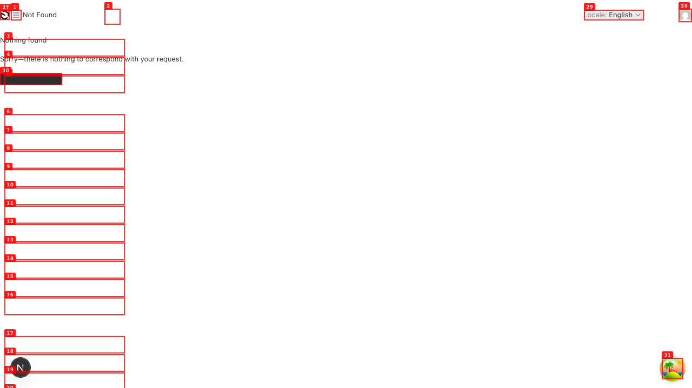

---

### ISSUE-008: Workbox AUTHOR column reads "Unknown" for every item — possible regression of #75

| Field | Value |
|-------|-------|
| **Severity** | medium |
| **Category** | functional / data |
| **URL** | http://localhost:3000/admin/workbox |
| **Repro Video** | N/A |

**Description**

The Workbox queue lists 5 in-flight items (Public Sector Liability Measurement, Webinar: PSAS Update, Research Program: Financial Reporting Trends, PSAB Publishes Implementation Guidance, CSSB Climate Disclosure Framework Released) and every row shows AUTHOR = `Unknown`. This is the exact symptom that #75 fixed in early May (`usersRead` access was relaxing so the populated `createdBy` relation would survive the `depth=1` Workbox fetch).

Possibilities:
- The seed test data isn't populating `createdBy` on workflow items, so the field is genuinely null and the `getAuthorName` helper falls through to `'Unknown'`. Could be fixed by setting `createdBy` on the seed rows.
- Or the access fix has regressed and the populated relation is being nulled for cross-user reads again — would be a real regression of #75.

Worth confirming whether the underlying rows have `createdBy` populated, then deciding which side to fix.

**Repro Steps**

1. Sign in to `/admin` as `admin@test.com`.
2. Visit `/admin/workbox`.
   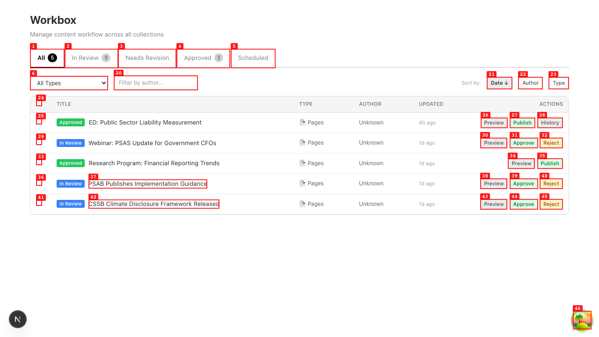
3. Observe AUTHOR column is `Unknown` for all 5 rows.

---

### ISSUE-007: Admin dashboard widgets — Workflow Queue rows visually overlap

| Field | Value |
|-------|-------|
| **Severity** | low |
| **Category** | visual |
| **URL** | http://localhost:3000/admin |
| **Repro Video** | N/A |

**Description**

In the Workflow Queue widget, the row text for "ED: Public Sector Liability Measurement" visually overlaps with "PSAB Publishes Implementation Guidance" on the row beneath it (and a similar overlap between the "Approved" / "In Review" group label rows). The widget is using a too-tight line-height or row padding for the rendered title length. Items render correctly individually but the vertical rhythm collapses when several rows + section headers stack.

**Repro Steps**

1. Sign in to `/admin` as an admin user, land on the dashboard.
2. Look at the Workflow Queue widget — APPROVED and IN REVIEW section headers overlap with their first row content.
   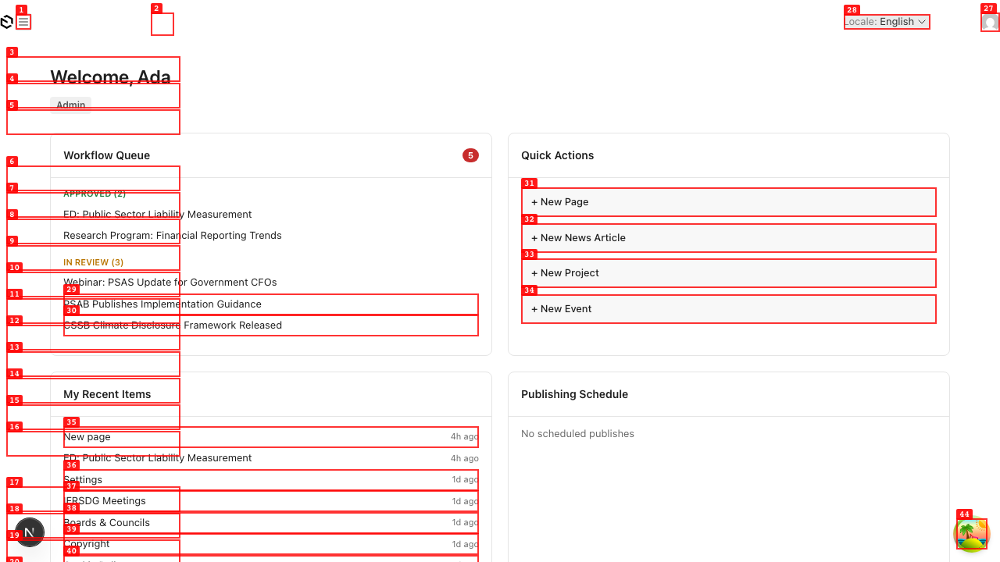

---

### ISSUE-006: Hardcoded EN strings leak into FR — hero search widget, header search, NewsGrid "View All", footer column headers

| Field | Value |
|-------|-------|
| **Severity** | high |
| **Category** | content / i18n |
| **URL** | http://localhost:3000/fr (also /fr/active-projects, /fr/open-consultations, etc.) |
| **Repro Video** | N/A |

**Description**

Sweeping `/fr` shows several surfaces where English strings are still hardcoded in components and never wired through `useTranslations`. The page-level body copy (H1, subtitles, board abbreviations, footer CMS links) translates correctly because of #77 / #143, but several "static UI chrome" strings inside React components were missed. The pattern matches what #77 caught in `BoardNav` + `ActiveProjectsClient` — same fix shape required for these surfaces.

**Concrete leaks observed across `/fr/*`:**

| Surface | File | EN string still rendered | Suggested key |
|---------|------|---------------------------|---------------|
| Hero project search input | `src/heros/HighImpact/index.tsx` | `placeholder="Find an active project"` | `homepage.findActiveProject` (new) |
| Hero project search button | `src/heros/HighImpact/index.tsx` | `Search` | `common.search` (already exists) |
| Site header global search input | `SiteHeader.tsx` | `placeholder="Projects, standards, and more..."` | `search.placeholder` (already exists) |
| `<NewsGridBlock>` view-all button | `NewsGridBlock/Component.tsx` | `View All` | `common.viewAll` (already exists) |
| `SiteFooter` "BOARDS" header | `SiteFooter.tsx` | `Boards` | `nav.boards` (already exists) |
| `SiteFooter` "LEGAL" header | `SiteFooter.tsx` | `Legal` | new key — `footer.legal` |
| `Breadcrumb` "Home" item | `Breadcrumb.tsx` | `Home` | `breadcrumb.home` (already exists) |
| Project Timeline stage labels | `Timeline.tsx` (or similar) | `Stage 2:` etc. | `projects.stage` (new) |
| `<BoardLanding>` "Recent News" h2 | `BoardLanding.tsx` | `Recent News` | `boards.recentNews` (already exists) |
| `<BoardLanding>` "View all" link | `BoardLanding.tsx` | `View all` | `common.viewAll` (already exists) |
| `<BoardLanding>` "Active Projects" h2 | `BoardLanding.tsx` | `Active Projects` | `projects.title` (already exists) |
| `<BoardLanding>` "About" sidebar header | `BoardLanding.tsx` | `About` | new key — `boards.about` |
| `<BoardLanding>` 4 sidebar links | `BoardLanding.tsx` | `Members & committees`, `Annual report`, `Meetings & events`, `Documents for comment` | new keys |
| `ContactUsPage` H1 fallback | `contact-us/page.tsx` | `Contact Us` | `nav.contactUs` (already exists) |
| `ContactUsPage` intro fallback | `contact-us/page.tsx` | `Send us a question, comment, or media inquiry…` | new key — `contact.introFallback` |
| `ContactForm` field labels | `ContactForm.tsx` | `Full Name`, `Title`, `Organization`, `Email Address`, etc. | `forms.*` (mostly already exist) |
| Search page `Filters` heading | `FilterSidebar.tsx` | `Filters` | `search.filterBy` (already exists) |
| Search page `By Board` / `By Standard` | `FilterSidebar.tsx` | hardcoded EN section labels | `filters.board`, `filters.standard` (both exist) |
| Search page "0 results found" / "No results found" | `SearchPageClient.tsx` | hardcoded EN | `search.resultsCount`, `search.noResults` (exist) |
| Search page "Try adjusting your search terms…" | `SearchPageClient.tsx` | hardcoded EN | `search.tryDifferent` (exists) |

**Repro Steps**

1. Visit `/fr`.
   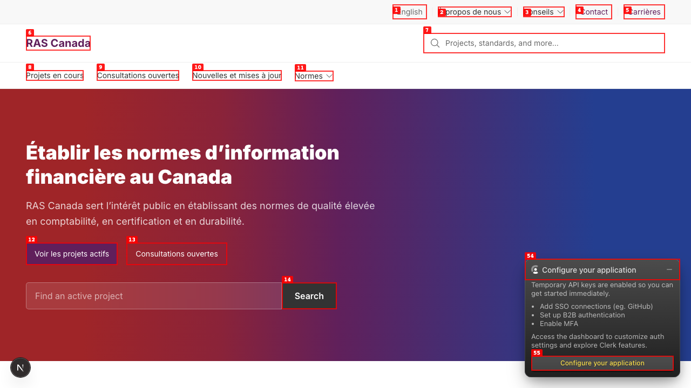
2. Scroll down — News grid "View All" stays English.
   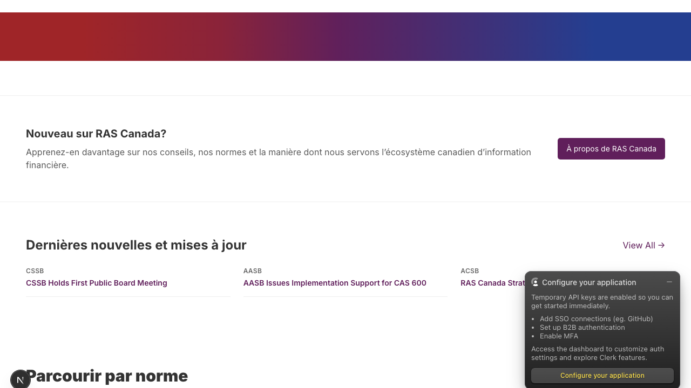
3. Scroll to footer — "BOARDS" and "LEGAL" column headers stay in English while "NORMES" and "LIENS RAPIDES" are translated.
   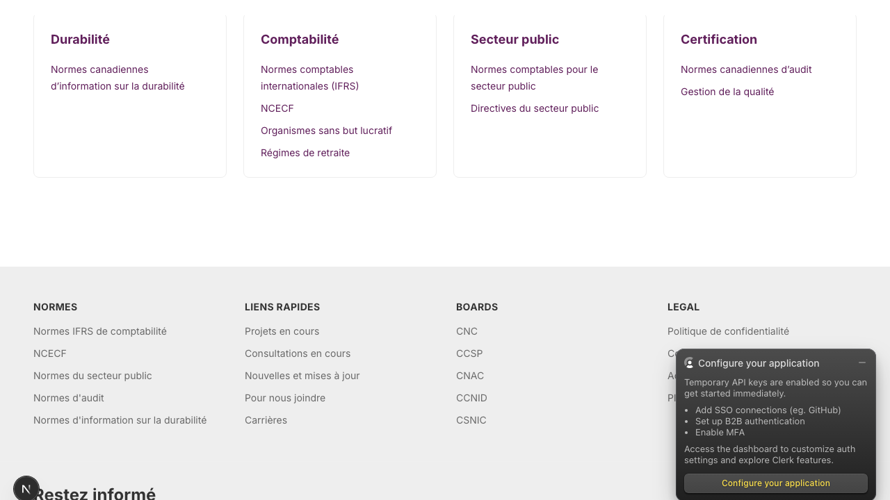
4. Visit `/fr/cnc` (FR slug for AcSB) — Breadcrumb "Home", BoardLanding "Recent News" / "View all" / "Active Projects" / "About" / 4 sidebar links all in EN.
   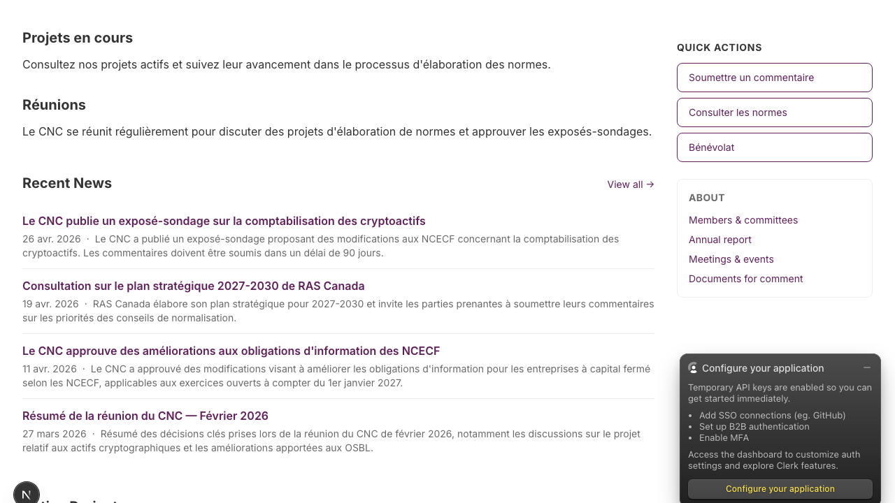
5. Visit `/fr/nous-joindre` — H1 "Contact Us", intro paragraph, all form labels stay in English.
   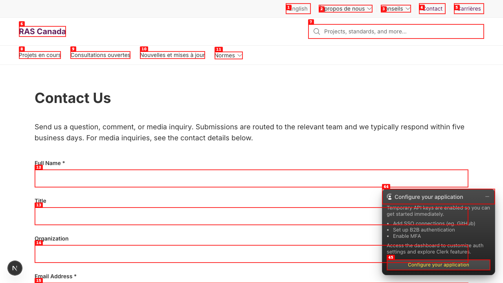
6. Visit `/fr/recherche?q=crypto` — Filters sidebar headings, breadcrumb, empty-state copy all stay in English.
   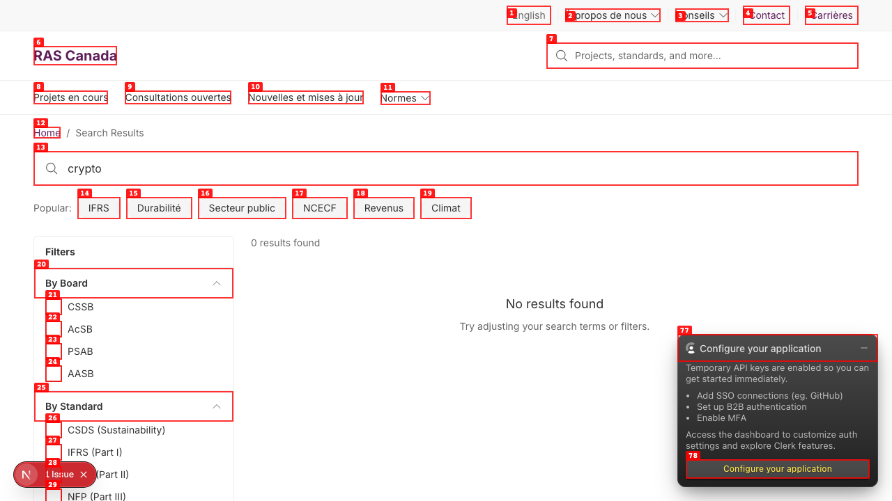

---

### ISSUE-005: Sitewide search returns 0 results for every query (Meilisearch keys missing in env)

| Field | Value |
|-------|-------|
| **Severity** | high |
| **Category** | functional / config |
| **URL** | http://localhost:3000/en/search?q=crypto (also any other query) |
| **Repro Video** | N/A |

**Description**

`/en/search?q=<anything>` always renders "0 results found / No results found / Try adjusting your search terms or filters." Both Meilisearch and the search UI are wired up correctly:

- Meilisearch container is up — `curl http://localhost:7700/health` returns `{"status":"available"}`.
- The reindex script #122 (commit ae5ba46) populated 231 docs across 6 indexes.
- The frontend's `SearchPageClient` resilient client wraps the InstantSearch client to swallow connection errors and return empty results — that's why no error surfaces in the UI.

The actual block is in `.env`: `MEILISEARCH_ADMIN_KEY` and `NEXT_PUBLIC_MEILISEARCH_SEARCH_KEY` are both empty. Meilisearch was started with a master key, so unauthenticated requests from the frontend are rejected — and the resilient client masks the auth failure as "no results."

CLAUDE.md prohibits editing `.env` from the agent. The user needs to set both env vars to the Meilisearch master key (or a search-only API key derived from it) and restart `npm run dev`.

**Repro Steps**

1. Visit `/en/search?q=crypto` (or `acsb`, `ifrs`, `meeting`, etc.).
   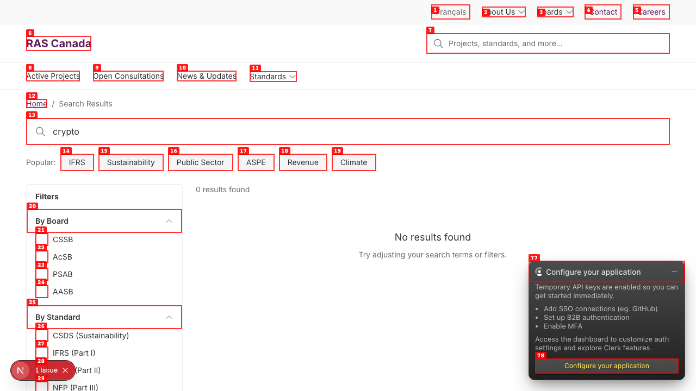
2. Observe "0 results found" empty state for every query.
3. `grep -E "MEILI|SEARCH_KEY" .env` shows both keys are empty.

---

### ISSUE-004: Document detail page is missing a breadcrumb

| Field | Value |
|-------|-------|
| **Severity** | medium |
| **Category** | ux |
| **URL** | http://localhost:3000/en/acsb/documents/ed-crypto-assets-dfc |
| **Repro Video** | N/A |

**Description**

Every other public detail page (board landing, project detail, news detail) renders a breadcrumb at the top of the layout (Home > Section > [item title]). The document detail page jumps straight from the global header into the H1 with no breadcrumb, so a user who lands on a document via deep link or search has no on-page way back to the parent board page or the documents listing — they have to use the browser back button or the global nav.

**Repro Steps**

1. Visit `/en/acsb/documents/ed-crypto-assets-dfc`.
   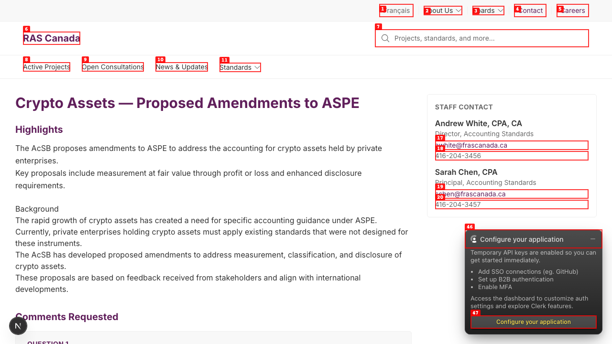
2. Compare with `/en/active-projects/acsb/accounting-for-crypto-assets` — that page shows "Home > Active Projects > AcSB > Accounting for Crypto Assets" but the document detail page has no breadcrumb at all.

---

### ISSUE-003: Project detail left-rail uppercases the board abbreviation ("ACSB" instead of "AcSB")

| Field | Value |
|-------|-------|
| **Severity** | low |
| **Category** | content / visual |
| **URL** | http://localhost:3000/en/active-projects/acsb/accounting-for-crypto-assets |
| **Repro Video** | N/A |

**Description**

The project-detail left-rail SectionNav header renders "ACSB" in all caps because the styling applies `text-transform: uppercase` to the board name string. The rest of the UI (breadcrumb on the same page, board landing H1, BoardNav sidebar after #128) preserves the canonical mixed-case "AcSB". CSS-uppercasing "AcSB" produces "ACSB", which works against the same brand-casing rule that #82 fixed elsewhere.

Drop the uppercase utility on that one label, or pass an already-uppercase token (e.g. `tracking-wide` + small caps font feature) so the source string stays mixed-case for assistive tech reading the underlying text.

**Repro Steps**

1. Visit `/en/active-projects/acsb/accounting-for-crypto-assets`.
   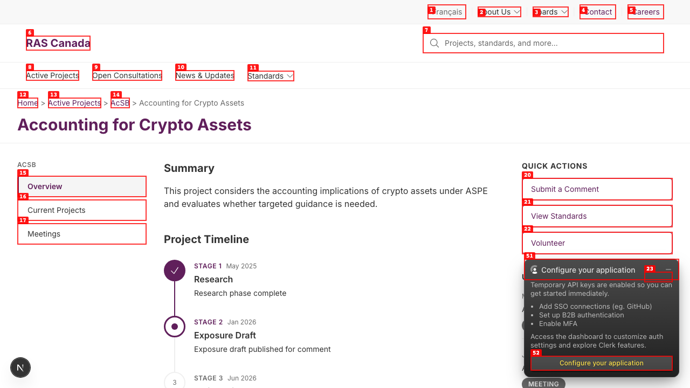
2. Compare the breadcrumb tail ("AcSB") with the left-rail header ("ACSB") — same source, two different casings.

---

### ISSUE-002: Board landing pages inherit a generic, legacy-branded `<title>` — SEO + brand leak

| Field | Value |
|-------|-------|
| **Severity** | high |
| **Category** | content / accessibility / seo |
| **URL** | http://localhost:3000/en/acsb (also /en/aasb, /en/cssb, /en/psab) |
| **Repro Video** | N/A |

**Description**

All four board landing pages render the same `<title>` tag — `RAS Canada — Financial Reporting & Assurance Standards` — because none of them implement `generateMetadata`, so they fall through to the locale layout's hardcoded default. Two real problems land at once:

1. **Generic title across 4 distinct pages.** Browser tabs, browser history, bookmarks, and search-engine result snippets all read the same string for AcSB, AASB, CSSB, and PSAB. Reader can't tell board pages apart in their tab strip.
2. **Legacy brand name leaks.** "Financial Reporting & Assurance Standards" was retired in the rebrand to "Reporting and Assurance Standards Canada" — the same string we cleaned up in the i18n messages dictionary (PR #140) and the footer (PR #104), but the layout's metadata default at `src/app/(frontend)/[locale]/(frontend)/layout.tsx:54` was missed. Every page that doesn't override metadata leaks the legacy name into search engines.

Listing pages (`/en/active-projects`, `/en/open-consultations`, `/en/news-listings`, `/en/contact-us`) all set their own titles correctly, so the same fix shape applies: add `generateMetadata` to the board-landing path that builds `${board.abbreviation} — ${board.name} — RAS Canada` from the locale-aware Payload data, and update the layout default to drop the legacy string.

**Repro Steps**

1. Visit `/en/acsb`, `/en/aasb`, `/en/cssb`, `/en/psab` and look at the browser tab title — all four read "RAS Canada — Financial Reporting & Assurance Standards".
2. `curl -s http://localhost:3000/en/acsb | grep title` confirms `<title>RAS Canada — Financial Reporting &amp; Assurance Standards</title>`.

   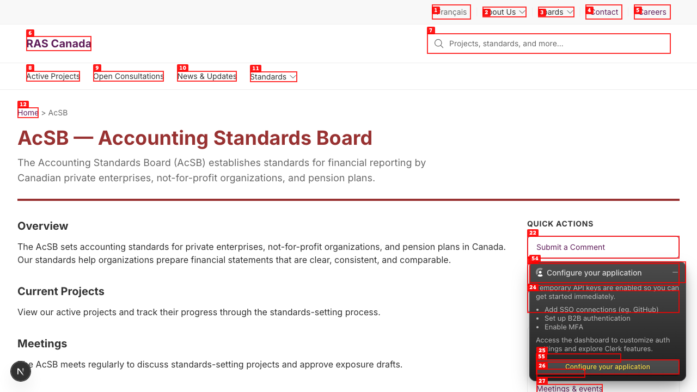

---

### ISSUE-001: Open Consultations cards show full board names — inconsistent with the rest of the UI

| Field | Value |
|-------|-------|
| **Severity** | medium |
| **Category** | content / ux |
| **URL** | http://localhost:3000/en/open-consultations |
| **Repro Video** | N/A |

**Description**

Consultation cards render the board's full name in the meta line ("Public Sector Accounting Board · Public Sector Accounting Standards", "Accounting Standards Board · Accounting Standards for Private Enterprises"). The rest of the public UI — Active Projects sidebar (#128), board landings (`<abbreviation> — <name>`), badges, breadcrumbs — uses the short abbreviation (PSAB, AcSB). The mixed pattern reads as an oversight on this surface and forces extra reading.

Same fix shape as #128 (BoardNav): swap the rendered string for `board.abbreviation`, falling back to `board.name`.

**Repro Steps**

1. Visit `/en/open-consultations`.
   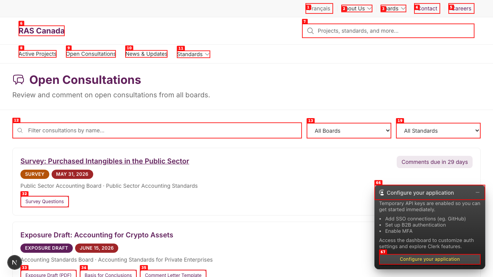
2. Observe the meta line under each consultation title — it reads "Public Sector Accounting Board · …" / "Accounting Standards Board · …" instead of "PSAB · …" / "AcSB · …".

---
