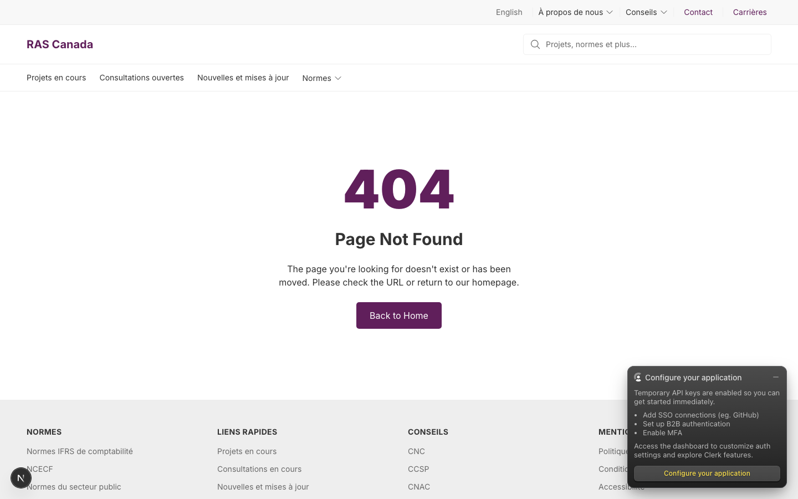
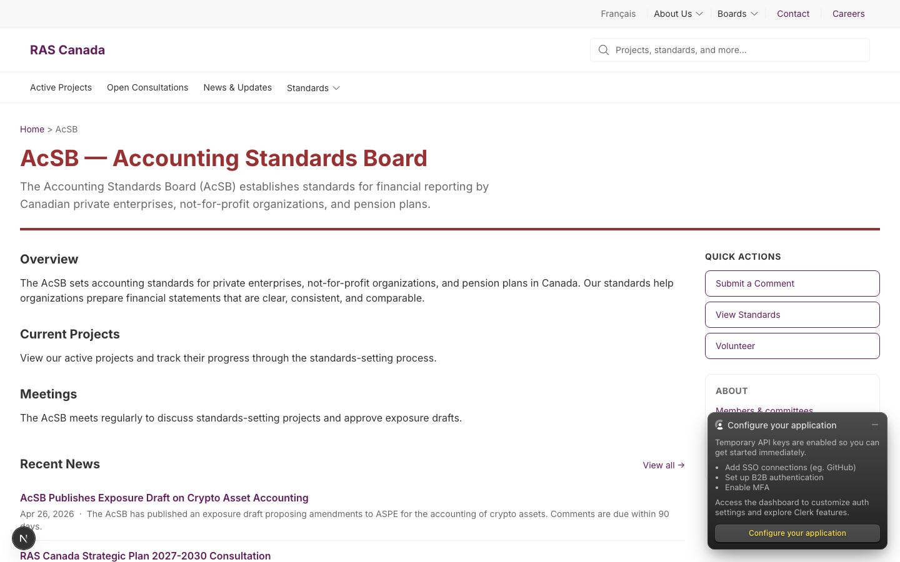
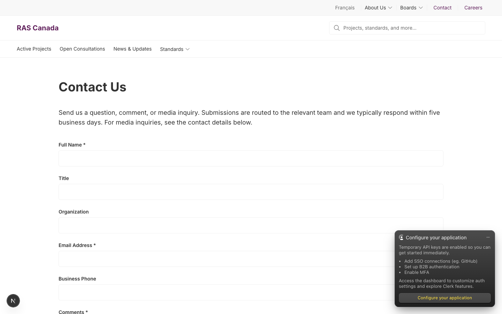
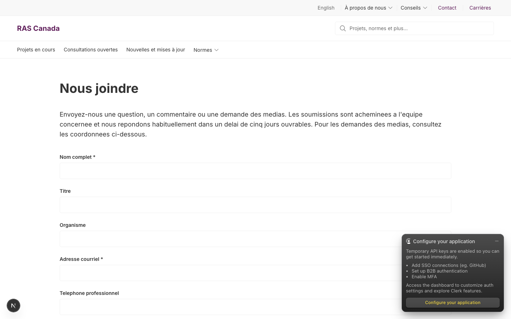
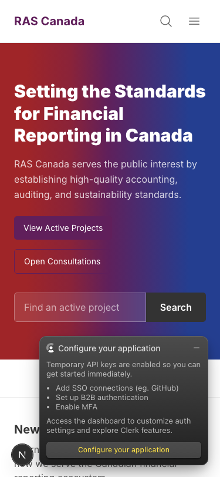
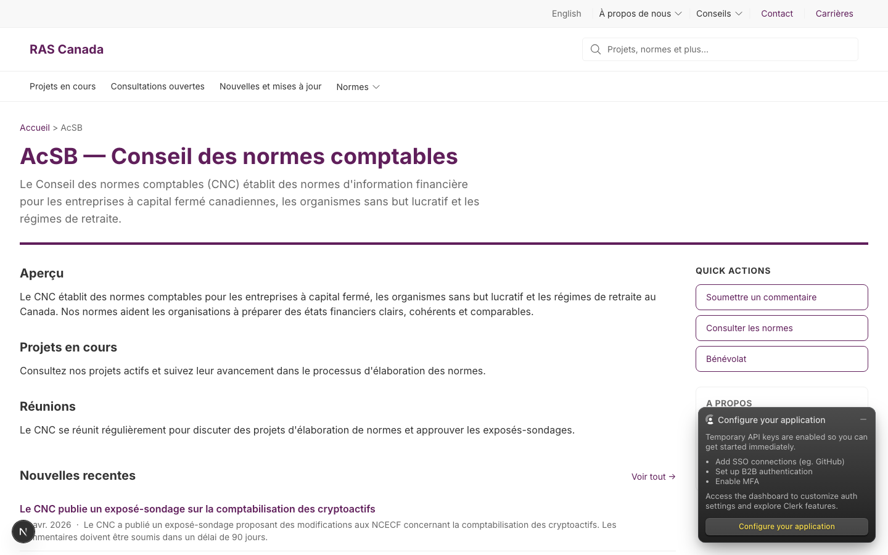
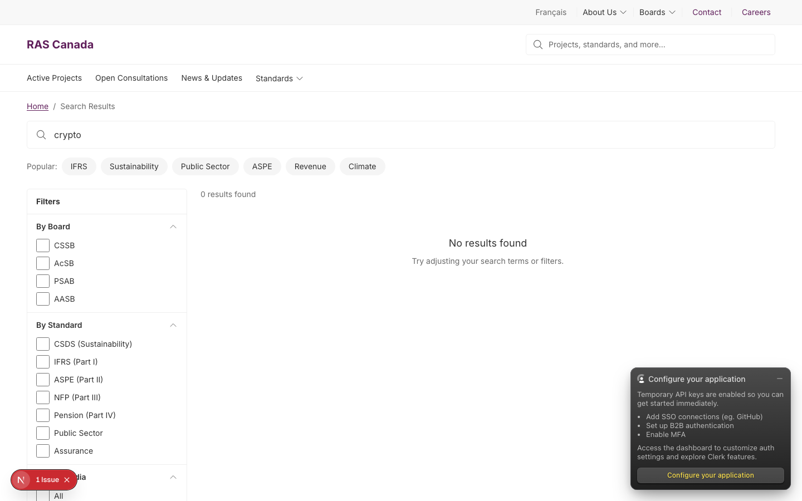
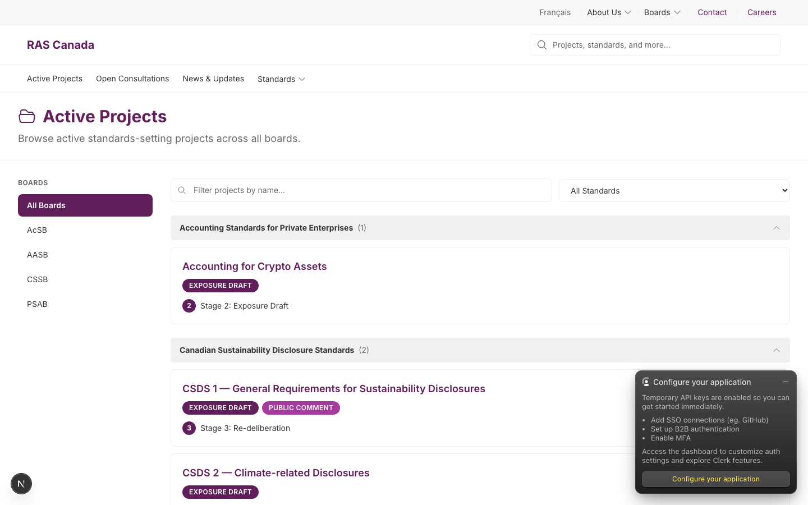
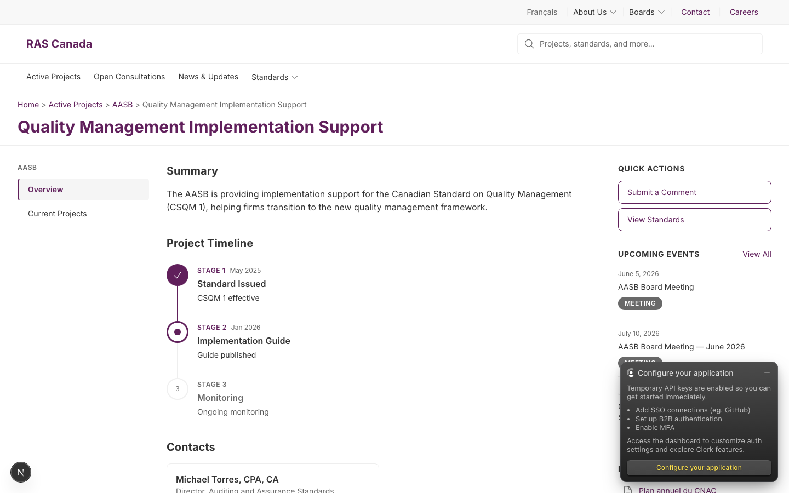
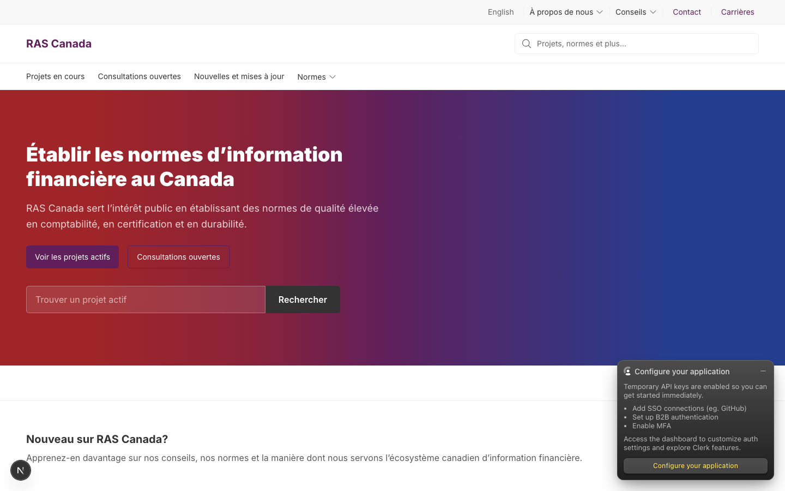

# Dogfood Report: FRAS / RAS Canada — Light-mode visual pass

| Field | Value |
|-------|-------|
| **Date** | 2026-05-03 |
| **App URL** | http://localhost:3000 |
| **Session** | fras-light-mode |
| **Scope** | Public frontend visual / UX quality (EN + FR), desktop 1440 + mobile 375 |

User trigger: "smoke test please, for example the light mode looks like ass." Just-shipped FR i18n sweep (PRs #164–#170) is in scope only as a regression check; primary focus is visual polish on the light theme.

## Summary

| Severity | Count |
|----------|-------|
| Critical | 1 |
| High | 3 |
| Medium | 4 |
| Low | 1 |
| **Total** | **9** |

## Issues

### ISSUE-001: `/fr/projets-actifs/<board>/<slug>` returns 404 — and the 404 page is in English

| Field | Value |
|-------|-------|
| **Severity** | critical |
| **Category** | functional + content |
| **URL** | http://localhost:3000/fr/projets-actifs/cnac/qm-implementation |
| **Repro Video** | N/A |

**Description**

Project detail pages have no working FR URL. The English route `/en/active-projects/aasb/qm-implementation` resolves; the French equivalent `/fr/projets-actifs/cnac/qm-implementation` 404s. Worse: the 404 page itself is fully in English ("Page Not Found", "The page you're looking for doesn't exist or has been moved.", "Back to Home") even though it's served on a `/fr/` route.

This is two bugs stacked:
1. Localized routing for the project-detail segment (`/active-projects/[board]/[project-slug]` → `/projets-actifs/[board]/[project-slug]` with FR board slugs `cnac` / `cnc` / `ccsp` / `ccnid`) is not wired up.
2. The Next.js `not-found.tsx` (or equivalent) does not call `useTranslations` / `getTranslations` — it ignores the `[locale]` segment of the URL.

**Repro Steps**

1. Visit `/fr/projets-actifs/cnac/qm-implementation`. Expected: same project detail page as `/en/active-projects/aasb/qm-implementation`, in French. Actual: 404.
   

---

### ISSUE-002: Light mode looks flat — no card surfaces, no shadows, no visual hierarchy below the hero

| Field | Value |
|-------|-------|
| **Severity** | high |
| **Category** | visual |
| **URL** | http://localhost:3000/en + /en/acsb |
| **Repro Video** | N/A |

**Description**

Below the hero band, every page collapses into stacked panels of pure white on white-ish gray with hairline 1px gray borders. There is no card elevation, no shadows, no surface distinction between the page background and content cards, and no visual rhythm between sections. The result reads as an unstyled wireframe rather than a finished product.

Specifics on `/en/acsb`:
- "Quick Actions" sidebar is a 1px box flush against a bordered "About" card that's also a 1px box — both feel like form fieldsets, not navigation surfaces.
- Section headings (Overview / Current Projects / Meetings / Recent News) all share the same weight, size, and color — no scale break.
- "Recent News" + "Active Projects" rows have no card affordance, no spacing rhythm, no hover surface.

Specifics on `/en` homepage:
- "New to RAS Canada?" intro section is just body text on white, no surface treatment.
- "Latest news & updates" and "Browse by Standard" sit on a flat white background with no contrast against the overall page surface — the visual breaks come only from H2s and a thin `
`.

**Repro Steps**

1. Visit `/en` — content below the gradient hero is one continuous white slab.
   
2. Visit `/en/acsb` — sidebar "Quick Actions" + "About" cards are indistinguishable from the body, sections share the same H2 treatment.
   

**Suggested fix**

Define an elevated `--surface-card` token (e.g., `oklch(99% 0 0)` with `box-shadow: 0 1px 2px rgba(15, 23, 42, .04), 0 1px 3px rgba(15, 23, 42, .06)`) and apply to: sidebar widget cards (Quick Actions / About / Upcoming Events), board section card containers on the homepage, and the active-projects content cards. Bump the page background one shade cooler (`bg-page` → `oklch(98% 0.005 250)`) so cards read as floating against the page, not embedded in it.

---

### ISSUE-003: Form inputs have no visible border — Contact page reads as empty rectangles on white

| Field | Value |
|-------|-------|
| **Severity** | high |
| **Category** | visual + accessibility |
| **URL** | http://localhost:3000/en/contact-us + /fr/nous-joindre |
| **Repro Video** | N/A |

**Description**

The 6 contact form inputs render as ~1px borders that are nearly the same color as the page background — at 1440 viewport you can barely see a field exists below the label. There's no fill color, no inset shadow, no focus-visible visual differentiation from the page surface. Combined with the lack of card elevation around the form, the whole page reads as floating labels with no associated input affordance.

**Repro Steps**

1. Visit `/en/contact-us`. The Full Name / Title / Organization / Email Address / Business Phone / Comments inputs have no visible chrome.
   
2. Same on `/fr/nous-joindre`.
   

**Suggested fix**

Inputs need either (a) `border: 1px solid oklch(85% 0 0)` (visible at AA contrast vs the page) plus a `bg-surface-input` token slightly off-white, or (b) ditch the border and use a 2px bottom-border underline style. Either way, focus state needs a visible 2px ring in brand purple. Currently failing WCAG SC 1.4.11 (non-text contrast) for the input borders.

---

### ISSUE-004: "Open Consultations" CTA button on hero is invisible on mobile (low contrast outline against gradient)

| Field | Value |
|-------|-------|
| **Severity** | high |
| **Category** | visual + accessibility |
| **URL** | http://localhost:3000/en (mobile 375) |
| **Repro Video** | N/A |

**Description**

The hero's secondary CTA renders as a transparent button with a thin white-ish outline. Against the red→purple gradient, the outline reads as ~2:1 contrast — below WCAG SC 1.4.11. The label text is white-on-gradient and is readable, but the button shape itself is unrecognisable as an interactive element at a glance.

**Repro Steps**

1. Visit `/en` on mobile (375 viewport). The "Open Consultations" outline button below "View Active Projects" is barely there.
   

**Suggested fix**

Solid CTA in white-on-purple OR `bg-white/15` with `border-white/60` for a glass effect that still reads as a surface. The current "ghost" treatment shouldn't be used over a gradient.

---

### ISSUE-005: Board landing sidebar widgets have no visual separation from each other or the body

| Field | Value |
|-------|-------|
| **Severity** | medium |
| **Category** | visual |
| **URL** | http://localhost:3000/en/acsb + /fr/cnc |
| **Repro Video** | N/A |

**Description**

The right rail on `/en/acsb` stacks Quick Actions → About vertically with identical 1px borders, identical padding, identical heading treatment, and no spacing or shadow to indicate they are separate widgets. They read as one continuous bordered region cut by a divider line, not as two distinct widgets.

**Repro Steps**

1. Visit `/en/acsb`. Right rail: Quick Actions card + About card are visually fused.
   
2. Same shape on `/fr/cnc`.
   

**Suggested fix**

Either (a) increase vertical gap between the sidebar widgets to ~24px and give each a subtle shadow + slightly heavier corner radius, or (b) drop the borders entirely and rely on background tint + shadow for the elevation cue (more modern but bigger refactor).

---

### ISSUE-006: Search page filter checkboxes are oversized relative to the labels (24×24 next to 14px text)

| Field | Value |
|-------|-------|
| **Severity** | medium |
| **Category** | visual |
| **URL** | http://localhost:3000/en/search?q=crypto |
| **Repro Video** | N/A |

**Description**

`FilterSidebar` checkboxes use `h-6 w-6` (24×24) which is great for touch targets but visually overpowers the 14px label text next to them. The result is each row has the checkbox dominating, making the filter list feel like a kid's worksheet rather than a refined faceted search panel. Also: there is no `gap` between checkbox and label that scales with the checkbox size — the label appears glued to the edge.

**Repro Steps**

1. Visit `/en/search?q=crypto`. Look at the By Board / By Standard checkboxes.
   

**Suggested fix**

Drop the checkboxes to `h-4 w-4` on desktop (keep 24×24 only on mobile via responsive class), or scale label text up to 15/16px to balance. Increase gap to `gap-3`.

---

### ISSUE-007: Active-projects sidebar treats "All Boards" as a filled brand-purple pill — implies it's selected, but it's also the default state

| Field | Value |
|-------|-------|
| **Severity** | medium |
| **Category** | ux |
| **URL** | http://localhost:3000/en/active-projects |
| **Repro Video** | N/A |

**Description**

`/en/active-projects` shows a left-rail board nav with "All Boards" rendered as a filled brand-purple pill, while AcSB / AASB / CSSB / PSAB are plain text rows. That correctly reflects "All Boards is selected by default", but visually it looks like an action button (e.g., "Click to reset") rather than a current-selection indicator. Users may mistake it for a "Clear filters" button.

**Repro Steps**

1. Visit `/en/active-projects`. Left rail "All Boards" looks like an action button, not a selection.
   

**Suggested fix**

Use a left-edge accent bar (`border-l-4 border-primary pl-3 bg-primary/5 text-primary font-semibold`) instead of a filled pill for the selected board. That's the standard pattern for vertical nav and reads as "current section" not "press to do something."

---

### ISSUE-008: Project Timeline stages render with the same purple as standard body links — no semantic distinction

| Field | Value |
|-------|-------|
| **Severity** | medium |
| **Category** | visual |
| **URL** | http://localhost:3000/en/active-projects/aasb/qm-implementation |
| **Repro Video** | N/A |

**Description**

On the project detail page the Timeline stage circles render: completed (filled purple), current (purple ring), future (gray). All three states use the same brand purple as primary action color (sidebar Submit a Comment button, View Standards button, breadcrumb link "Active Projects"). Result: the timeline doesn't read as a separate visual system — completed stages compete with primary CTAs for attention.

**Repro Steps**

1. Visit `/en/active-projects/aasb/qm-implementation`. Look at Stage 1 (filled purple), Submit a Comment button (outline purple), View Standards button (outline purple), Active Projects breadcrumb (purple text).
   

**Suggested fix**

Use a separate timeline-status color (e.g., a teal or success-green for completed; ringed neutral for current). Reserves brand purple for actions and breadcrumbs only.

---

### ISSUE-009: Footer policy links + copyright tail stay in English on FR pages

| Field | Value |
|-------|-------|
| **Severity** | low |
| **Category** | content / i18n |
| **URL** | http://localhost:3000/fr (footer) |
| **Repro Video** | N/A |

**Description**

The footer copyright tail "All rights reserved." and the policy links (Privacy Policy / Cookie Policy / Terms of Use) are still hardcoded English on FR routes. This was deliberately left out of #155 scope (the issue table only flagged BOARDS / LEGAL column headers and the copyright string still needs to use `BRAND.fullName` per PR #98), but it's worth tracking as a separate i18n cleanup so it doesn't get lost.

**Repro Steps**

1. Visit `/fr`, scroll to the bottom of the page.
   

**Suggested fix**

Translate the policy link labels — keys exist already (`footer.privacyPolicy`, `footer.cookiePolicy`, `footer.termsOfUse`) but aren't wired up. For the copyright string, split into a translated tail `t('footer.allRightsReserved')` plus the `BRAND.fullName` interpolation, so EN reads "© 2026 Reporting and Assurance Standards (RAS) Canada. All rights reserved." and FR reads "© 2026 NIFC Canada. Tous droits reserves."

---

## Notes for the next pass (not filed as issues)

- Clerk dev "Configure your application" widget overlaps content in every screenshot. Out of scope (already tracked under #89 for prod cutover).
- `/fr/recherche` shows "0 results found" because Meilisearch keys aren't seeded locally — already tracked as #160.
- FR strings in the dict deliberately use unaccented French (e.g. "Tous droits reserves" instead of "Tous droits réservés"). That's a project-wide convention; not a bug. If accent restoration is desired it should be a separate sweep with a clear policy call.
