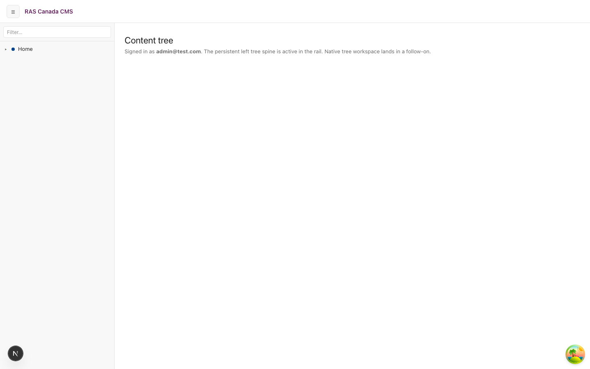
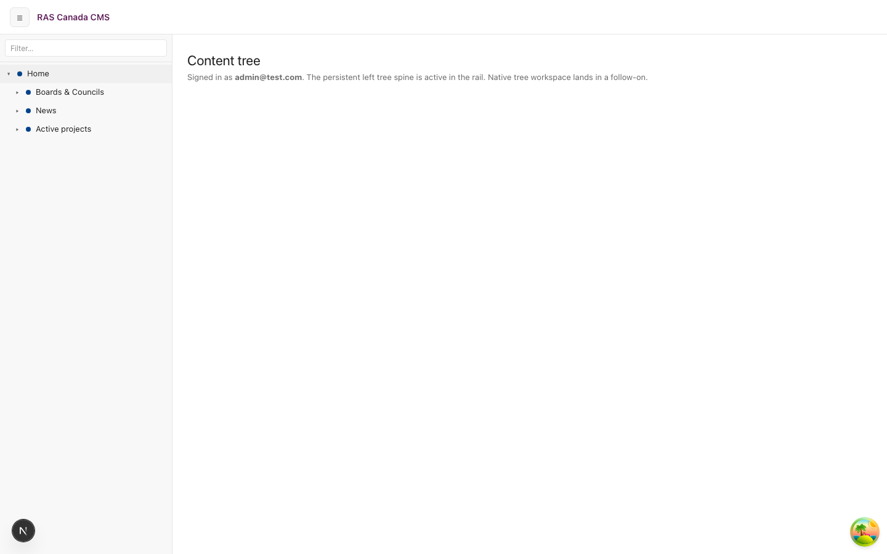
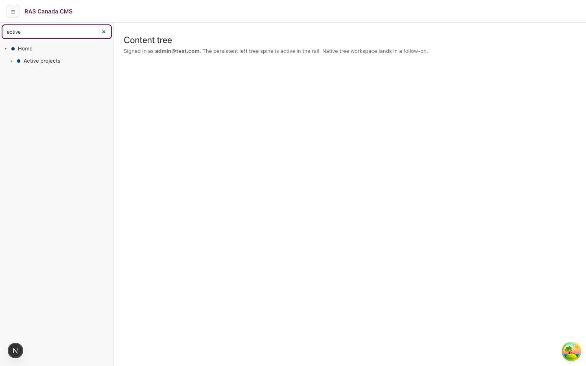
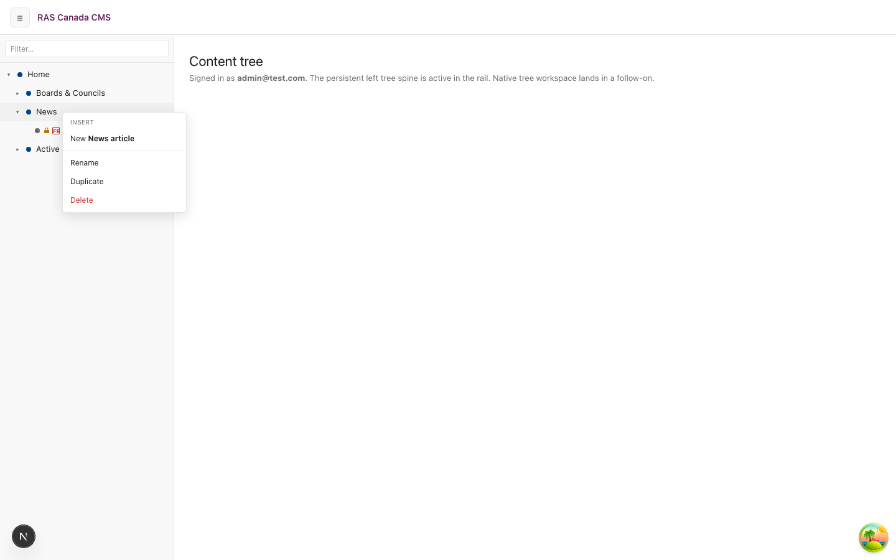
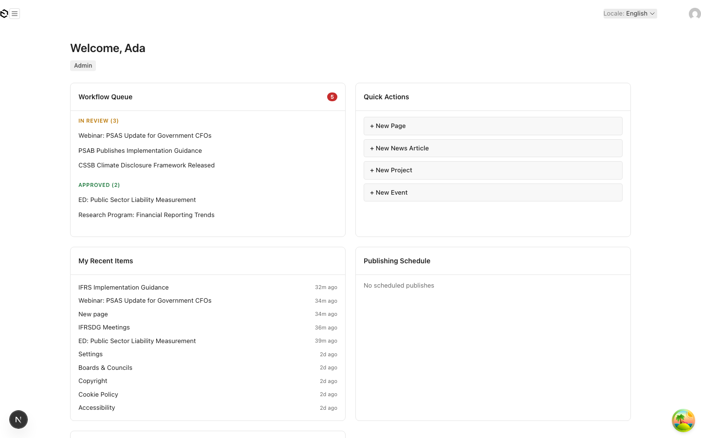
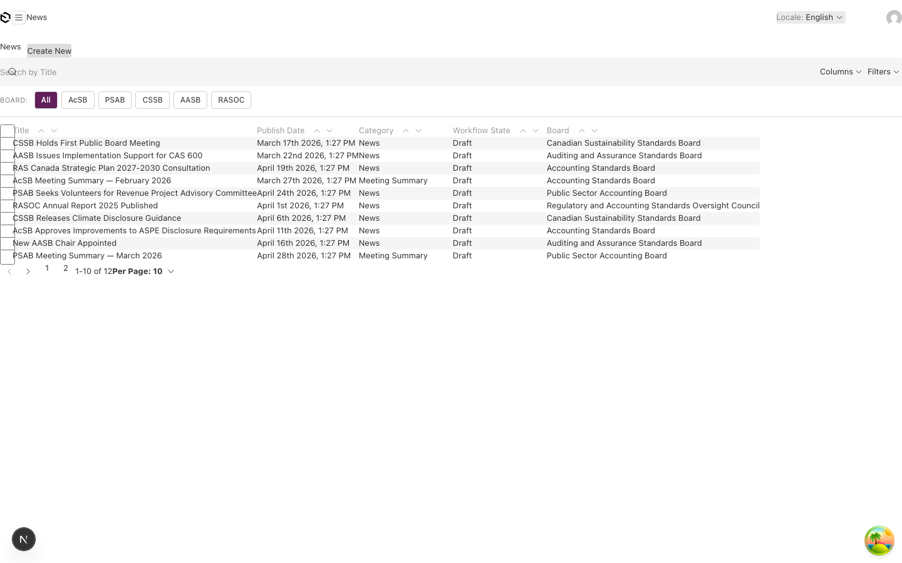
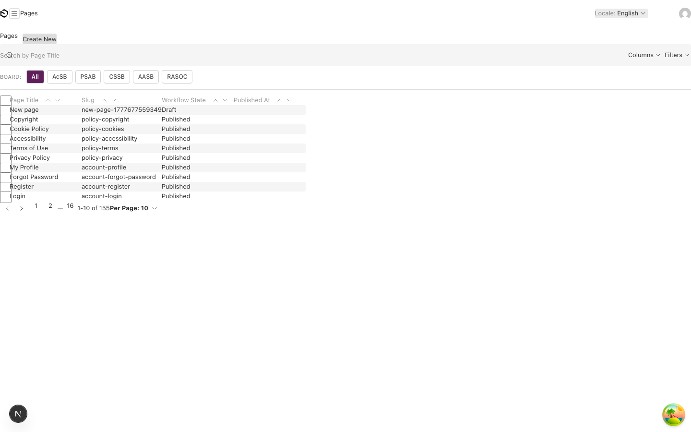
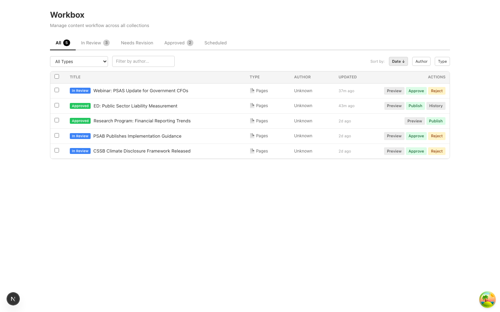
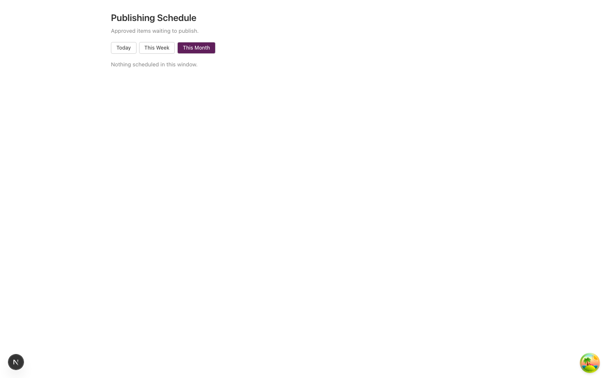

# Dogfood Report: Admin Shell

| Field | Value |
|-------|-------|
| **Date** | 2026-05-04 |
| **App URL** | http://localhost:3000/admin |
| **Session** | admin-dogfood |
| **Scope** | Admin panel visual quality + Content Tree functional regression |
| **Auth** | admin@test.com / Test1234! |

User trigger: "the admin panel looks like ass and the tree isn't working." Public-frontend visual polish (#181 surface-card, #182 input borders, etc.) deliberately did NOT touch the admin shell — that gap is now visible.

## Summary

| Severity | Count |
|----------|-------|
| Critical | 0 |
| High | 4 |
| Medium | 3 |
| Low | 1 |
| **Total** | **8** |

Categorisation:
- **(a) Tree bugs:** ISSUE-001
- **(b) Visual polish gaps:** ISSUE-002, ISSUE-003, ISSUE-004, ISSUE-006, ISSUE-008
- **(c) Other:** ISSUE-005, ISSUE-007

## Issues

### ISSUE-001: `/admin/tree` workspace is a stub — clicking nodes does nothing useful

| Field | Value |
|-------|-------|
| **Severity** | high |
| **Category** | functional / ux |
| **URL** | http://localhost:3000/admin/tree |
| **Repro Video** | N/A |

**Description**

The Content Tree's left rail navigation is alive (expand/collapse, search filter, right-click context menu with Insert / Rename / Duplicate / Delete all functional), but the entire workspace area is hardcoded to a placeholder:

> Signed in as **admin@test.com**. The persistent left tree spine is active in the rail. Native tree workspace lands in a follow-on.

Clicking any tree node — Home, Boards & Councils, News, Active projects, the "2026 Q1 update" leaf — keeps the same stub message visible. There is no per-node detail view. To the user this reads as "the tree is broken" because the obvious affordance (click a node, see its content) does nothing. The dev-language placeholder ("lands in a follow-on") is also leaking to end users.

**Repro Steps**

1. Sign in to `/admin`. Navigate to **Content tree** (`/admin/tree`).
   
2. Click the "Home" node — it expands to reveal Boards & Councils / News / Active projects, but the workspace stays as the placeholder.
   
3. Click the "News" node — same thing. The "2026 Q1 update" leaf becomes visible in the tree, workspace unchanged.
   
4. Search "active" in the filter — narrows tree to Home > Active projects (filter works ✓), workspace still stub.
   
5. Right-click on "News" — context menu opens with Insert / Rename / Duplicate / Delete (✓).
   

**Suggested fix**

Two paths:
1. Wire the workspace to the selected node — a doc preview / quick-edit panel keyed to the node id. This is the design intent per CLAUDE.md "Custom Admin Views (built) → Content Tree (Sitecore-style hierarchical browser with DnD, context menu, search)".
2. If shipping that workspace is out of reach this session, at minimum redirect the click to the matching collection edit view — clicking the News leaf should navigate to `/admin/collections/news/<id>` so the tree is at least a useful navigator.

Either is better than the stub. Replace the placeholder copy regardless — that string is dev-facing language ("lands in a follow-on") that shouldn't ship to editors.

---

### ISSUE-002: Admin dashboard widgets have no card elevation — flat-panel "wireframe" look

| Field | Value |
|-------|-------|
| **Severity** | high |
| **Category** | visual |
| **URL** | http://localhost:3000/admin |
| **Repro Video** | N/A |

**Description**

All four dashboard widgets (Workflow Queue, Quick Actions, My Recent Items, Publishing Schedule) sit flat on the page background with hairline borders only. No shadow, no surface tint, no separation from the page. The exact same complaint that drove the public-frontend `--surface-card` token in #181 / PR #190 — except #181 was scoped to public surfaces and the admin shell never got the matching treatment.

**Repro Steps**

1. Sign in to `/admin`.
   
2. Compare to the public homepage `/en` Browse-by-Standard cards (post-#181) — those have visible elevation + a cooler page bg. Admin doesn't.

**Suggested fix**

Mirror the public token system in `src/app/(payload)/admin-tailwind.css` (or wherever the admin theme lives):
- Define `--admin-surface-card` (white) + `--admin-surface-card-border` (#E6E6EA) + `--admin-shadow-card` (paired ambient + diffuse drop) tokens.
- Cool the admin page background one shade (e.g. `oklch(98% 0.005 250)`).
- Apply to `WidgetCard.tsx` so every widget — Workflow Queue, Quick Actions, Recent Items, Publishing Schedule, Pinned, etc. — picks up the elevation in one swap.

This is the `dogfood-4 light-mode` story for the admin shell.

---

### ISSUE-003: Generic Payload hexagon logo on `/admin` dashboard — no RAS branding

| Field | Value |
|-------|-------|
| **Severity** | high |
| **Category** | visual / content |
| **URL** | http://localhost:3000/admin |
| **Repro Video** | N/A |

**Description**

The login page renders the branded "RAS Canada" wordmark + "RAS CANADA CMS" sub-label per #40. The Content Tree page shows "RAS Canada CMS" in the top header. But the `/admin` dashboard has only a tiny grey Payload hexagon logo + an unlabelled hamburger button — no RAS wordmark anywhere on screen. Branding ships in some admin views and not others.

**Repro Steps**

1. Sign in. Land on `/admin` (dashboard) — top-left is just a hexagon icon.
   
2. Navigate to `/admin/tree` — top header now shows "RAS Canada CMS" wordmark.
   

**Suggested fix**

The Logo registration in `payload.config.ts` (graphics.Logo → BrandLogo from #40) should appear on every admin view. The dashboard view's wrapper either uses a different layout or strips the global header. Either route the dashboard through the same shell as the tree/workbox/etc. or mount BrandLogo inside the dashboard view directly.

---

### ISSUE-004: Search input overlaps the first column header on every collection list view

| Field | Value |
|-------|-------|
| **Severity** | high |
| **Category** | visual |
| **URL** | http://localhost:3000/admin/collections/news (and every other `/admin/collections/*`) |
| **Repro Video** | N/A |

**Description**

The "Search by Title" input sits on top of the header row's first column — the magnifier glyph and the first letter of the placeholder text are both clipped at the left edge of the viewport because the search input has zero left padding. Same on `/admin/collections/pages` and any other list. Visible in every admin list view captured this pass.

**Repro Steps**

1. Visit `/admin/collections/news`. Top row reads `🔍ch by Title` (the "Sear" prefix is hidden behind the search icon's spot).
   
2. Same on `/admin/collections/pages` (reached via the `/admin/builder` redirect).
   

**Suggested fix**

The list-view container needs left padding on both the search bar AND the table content. Currently the search input has no padding while the table sits at `padding-left: 0`, so column 0 is visually flush against the page edge.

---

### ISSUE-005: Workbox Author column shows "Unknown" for every row — regression of #75

| Field | Value |
|-------|-------|
| **Severity** | high |
| **Category** | functional |
| **URL** | http://localhost:3000/admin/workbox |
| **Repro Video** | N/A |

**Description**

All 5 rows in the Workbox queue show "Unknown" in the Author column. This is exactly the bug fixed in #75 / QA-005 (audit log entry 2026-05-02 — relaxed `usersRead` access so populated `createdBy` relations could resolve). Either the fix has reverted, the seed regenerated docs without `createdBy` populated, or the access fix doesn't cover this query path.

The recent commit `56d53d1 chore(seed): populate createdBy on every tree-seeded page (#163)` suggests the seed got patched — the Workbox view may not be applying the fix to its specific query yet, OR the existing 5 docs predate that seed change.

**Repro Steps**

1. Sign in. Navigate to `/admin/workbox`.
   

**Suggested fix**

Re-verify the Workbox fetch path:
1. The Workbox API call requests `depth >= 1` so `createdBy` populates.
2. The current logged-in user's role passes `usersRead` access.
3. The seed actually populated `createdBy` on these specific 5 docs (`Webinar: PSAS Update for Government CFOs`, `ED: Public Sector Liability Measurement`, etc.) — they may predate #163.
4. If 3 is the cause, re-run the seed.

---

### ISSUE-006: `/admin/schedule` renders without the global admin header

| Field | Value |
|-------|-------|
| **Severity** | medium |
| **Category** | visual / functional |
| **URL** | http://localhost:3000/admin/schedule |
| **Repro Video** | N/A |

**Description**

Most admin views render with the top header bar (hamburger nav toggle, RAS Canada CMS wordmark on some, Locale + avatar on the right). `/admin/schedule` is missing the entire top bar — just an H1 + subtitle + 3 toggle buttons floating in space. There's no way to navigate away without typing a URL or hitting browser back.

**Repro Steps**

1. Sign in. Navigate to `/admin/schedule` (Publishing Schedule).
   

**Suggested fix**

Whatever wrapper `/admin/tree` and `/admin/workbox` use for the top bar, this view needs the same. Probably a missing `<AdminShell>` wrapper (or equivalent) in `src/admin/views/ScheduleView.tsx`. Same audit likely needed on `/admin/language-audit` if it shares the pattern.

---

### ISSUE-007: `/admin/builder` (no `:id`) correctly redirects to Pages list — #162 verified

| Field | Value |
|-------|-------|
| **Severity** | low |
| **Category** | (regression check) |
| **URL** | http://localhost:3000/admin/builder |
| **Repro Video** | N/A |

**Description**

Positive finding. The `/admin/builder` (no `:id`) route used to hit Payload's generic 404 (#162). The fix from PR #214 redirects to `/admin/collections/pages` correctly — verified live during this pass. **The Pages list it lands on is what surfaced ISSUE-004 (search input overlap).**

**Repro Steps**

1. Type `http://localhost:3000/admin/builder` directly into the URL bar.
2. Observe redirect to `/admin/collections/pages`.
   

---

### ISSUE-008: Mystery palm-tree emoji button in the bottom-right of every admin view

| Field | Value |
|-------|-------|
| **Severity** | medium |
| **Category** | content / branding |
| **URL** | http://localhost:3000/admin (every view) |
| **Repro Video** | N/A |

**Description**

Every admin screenshot shows a circular palm-tree-and-island emoji button in the bottom-right corner. Almost certainly a third-party devtool button (the snapshot listed `Open Tanstack query devtools` as one of the page's buttons — likely the same widget). It's: (a) not branded, (b) visible to editors in dev, (c) sometimes the most colourful element on the screen.

**Repro Steps**

1. Sign in to any admin view. Look at bottom-right corner.
   

**Suggested fix**

Confirm the source. If Tanstack Query devtools, gate behind `NODE_ENV === 'development'` (likely already conditional but the wrapper may have been left on by a previous experiment). If kept in dev, swap the cartoon emoji for a neutral icon.

---

## Notes (not filed as issues)

- `/admin/media` rendered cleanly — folder rail, thumbnail grid, search bar and All Types filter all working.
- Tree filter (search), expand/collapse, right-click context menu all functional.
- Build/runtime stability: no console errors during the pass; only HMR + React DevTools info logs.
- The "looks like ass" gap is mostly issues 002 + 003 + 004 stacking together (no card elevation, missing brand logo on the most-visited surface, broken-looking list view) — fixing those three would change the demo significantly.
