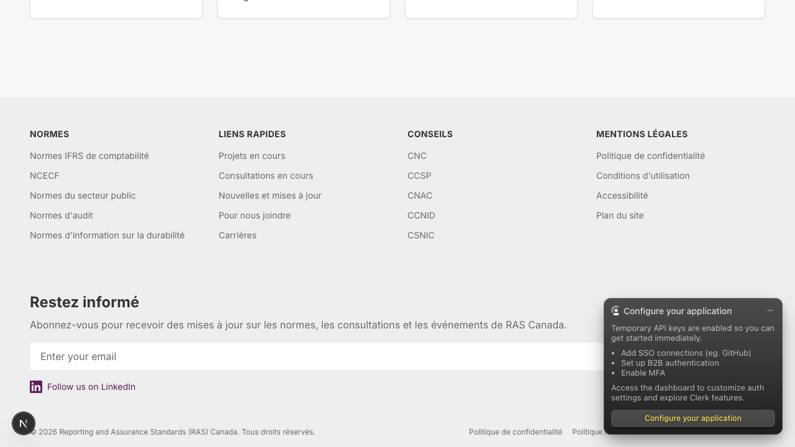
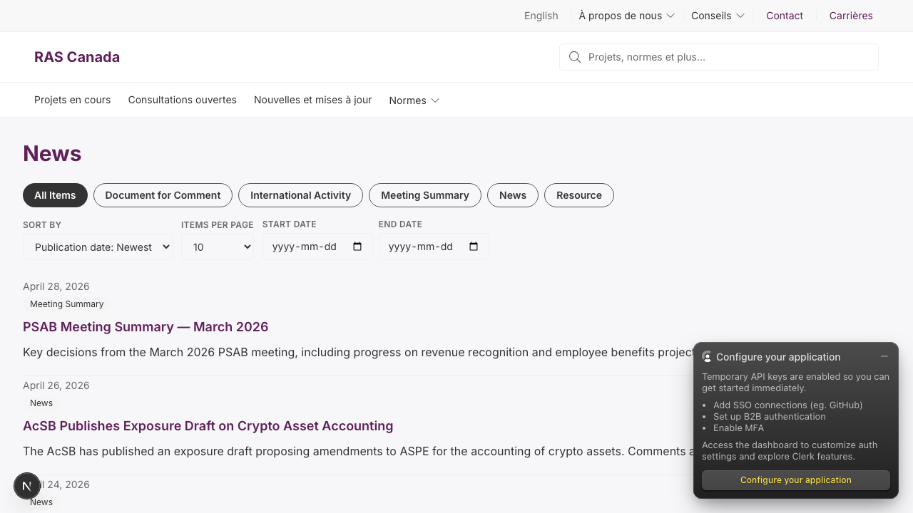
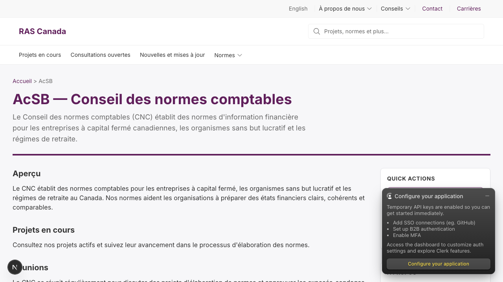
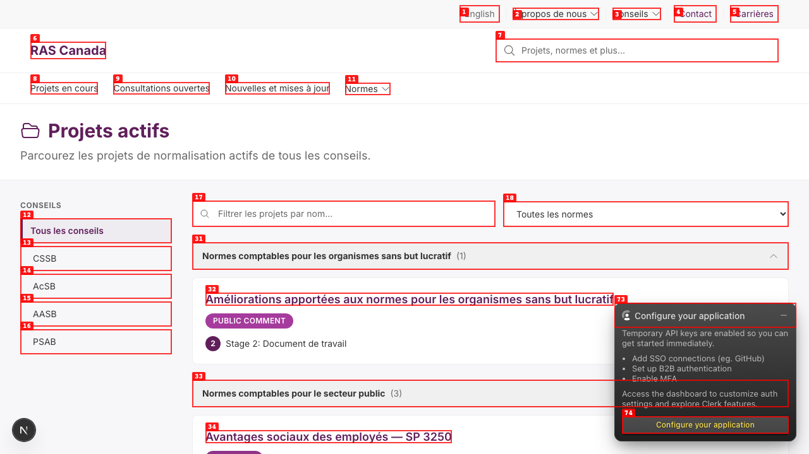
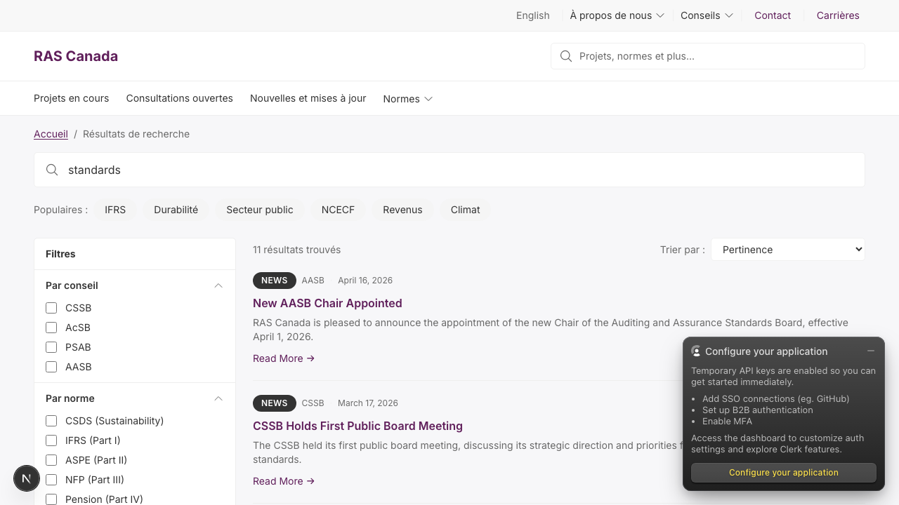
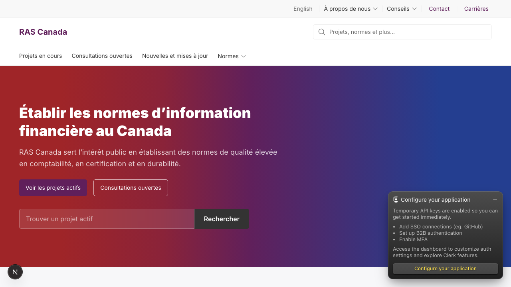
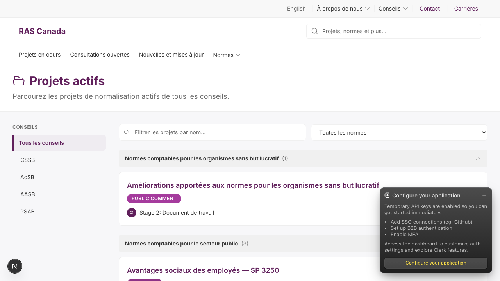

# Dogfood Report: FRAS Canada — Post Algolia Migration + Meilisearch Removal

| Field | Value |
|-------|-------|
| **Date** | 2026-05-04 |
| **App URL** | http://localhost:3000 |
| **Session** | fras-post-algolia-2026-05-04 |
| **Scope** | Public frontend only (skip /admin /cms). Homepage, listings, board landings, news, search w/ facets, FR locale, footer newsletter. |
| **Branch tested** | `chore/remove-meilisearch` rebased onto current `main` (PRs #227 + #230 + #231 merged) |
| **Looking for** | Regressions from i18n PRs, Algolia search edge cases, FR diacritic rendering, hardcoded English on /fr |

## Summary

| Severity | Count |
|----------|-------|
| Critical | 1 |
| High | 3 |
| Medium | 2 |
| Low | 1 |
| **Total** | **7** |

**Headline finding:** PR #229 (NewsletterCTA + 4 components i18n wiring) was merged into the now-deleted stack base `fix/215-fr-json-diacritics` instead of `main` — every component fix is orphaned. Recovery filed as PR #233.

**Search end-to-end works:** Algolia returns 11 hits on `/en/search?q=standards`, facet click narrows to 4 (board:"AcSB"), multi-select OR's to 6 (AcSB + AASB), zero MeiliSearch references in any served chunk, FR chrome on `/fr/recherche` properly localized (Filtres, Par conseil, Par norme, X résultats trouvés).

**Pages walked (0 console errors anywhere):** /en + /fr homepage, active-projects/projets-actifs, open-consultations/consultations-ouvertes, news-listings/nouvelles, all four board landings (acsb/cssb/psab/aasb + cnc/ccnid/ccsp/cnac), contact/nous-joindre, search empty + with results + with no results.

## Issues

### ISSUE-001: PR #229 merged into wrong base — every component i18n wiring orphaned

| Field | Value |
|-------|-------|
| **Severity** | critical |
| **Category** | content |
| **URL** | every `/fr/*` page (NewsletterCTA in footer, SiteHeader on every page) |
| **Repro Video** | N/A (static visible-on-load) |
| **Recovery PR** | #233 |

**Description**

PR #229 ("fix(i18n): wire NewsletterCTA, SiteHeader, SearchModal, MobileMenu, AnchorNav through next-intl") was created with `fix/215-fr-json-diacritics` as its base (a stacked PR pattern). When `fix/215` got merged into `main` via PR #227, only the fr.json diacritics changes traveled. The component i18n wiring sat on the stack-base merge commit, never landed on main, and the base branch was deleted post-merge — orphaning the entire #228/#229 effort.

Result: `Enter your email`, `Subscribe`, `Follow us on LinkedIn` (NewsletterCTA in footer); `Primary navigation` aria-label (SiteHeader); `Search / Close search / Search query` aria-labels + `Recent / Popular` h3s + `Cancel / Search` buttons (SearchModal); `Menu / Close menu / Search projects, standards... / Mobile navigation` (MobileMenu); `On this page` heading + aria-label (AnchorNav) — all render English on `/fr`.

**Repro**

1. Navigate to `http://localhost:3000/fr` — scroll to footer
   

2. **Observe** newsletter form: placeholder reads `Enter your email`, link reads `Follow us on LinkedIn`. The footer chrome around it (Restez informé, Abonnez-vous…) IS translated, so the contrast makes the regression obvious.

**Recovery**

PR #233 cherry-picks the orphaned commit `f6901c4` directly onto current main. No code changes — same diff #229 originally proposed. Awaits merge.

---

### ISSUE-002: `/fr/nouvelles` — entire page chrome English

| Field | Value |
|-------|-------|
| **Severity** | high |
| **Category** | content |
| **URL** | http://localhost:3000/fr/nouvelles |
| **Repro Video** | N/A (visible on load) |

**Description**

The /fr news listing page is a near-complete English regression — page header, filter pills, sort labels, and date pickers are not localized. Header reads `News` (should be `Nouvelles`). Filter pills: `All Items`, `Document for Comment`, `International Activity`, `Meeting Summary`, `News`, `Resource`. Sort: `SORT BY`, `Publication date: Newest`, `ITEMS PER PAGE`, `START DATE`, `END DATE`, `yyyy-mm-dd` placeholders, dates rendered as `April 28, 2026` (English long-form).

Note: news article *titles* + descriptions being English is a separate content-localization concern (the news collection only has EN content authored). This issue covers chrome only.

**Repro**

1. Navigate to `http://localhost:3000/fr/nouvelles`
   

---

### ISSUE-003: `/fr/cnc` — board landing uses EN abbreviation + English `QUICK ACTIONS` sidebar

| Field | Value |
|-------|-------|
| **Severity** | high |
| **Category** | content |
| **URL** | http://localhost:3000/fr/cnc |
| **Repro Video** | N/A |

**Description**

Two things on the board-landing FR page:
1. Page heading reads `AcSB — Conseil des normes comptables` and breadcrumb shows `Accueil > AcSB`. Per CLAUDE.md the FR brand is `CNC` — header should read `CNC — Conseil des normes comptables` and breadcrumb `Accueil > CNC`.
2. Right-rail widget heading is hardcoded `QUICK ACTIONS` — should be `ACTIONS RAPIDES`. The translation key `boards.quickActions` already exists in messages.fr.json with that French value but the BoardLanding component doesn't use it.

The footer's `CONSEILS` column DOES translate the abbreviations (CNC, CCSP, CNAC, CCNID, CSNIC). So the data is there — the BoardLanding component needs to use `board.abbreviation_fr` instead of `board.abbreviation`.

**Repro**

1. Navigate to `http://localhost:3000/fr/cnc`
   

---

### ISSUE-004: `/fr/projets-actifs` project card status badge + stage label English

| Field | Value |
|-------|-------|
| **Severity** | high |
| **Category** | content |
| **URL** | http://localhost:3000/fr/projets-actifs |
| **Repro Video** | N/A |

**Description**

On the FR active projects listing, the project status badge renders `PUBLIC COMMENT` (should be a French equivalent like `EN COMMENTAIRE PUBLIC`). The stage indicator reads `Stage 2: Document de travail` — the value is FR (`Document de travail`) but the prefix `Stage 2:` is English (should be `Étape 2:`).

The page chrome around it (Projets actifs, sidebar, filters) IS translated correctly — same regression pattern as ISSUE-002 (chrome localized, content/badges hardcoded).

**Repro**

1. Navigate to `http://localhost:3000/fr/projets-actifs`
   

---

### ISSUE-005: `/fr/recherche` result cards — `NEWS` badge + `Read More →` + English dates

| Field | Value |
|-------|-------|
| **Severity** | medium |
| **Category** | content |
| **URL** | http://localhost:3000/fr/recherche?q=standards |
| **Repro Video** | N/A |

**Description**

Search page chrome (Filtres, Par conseil, Par norme, "X résultats trouvés", Trier par, Pertinence) is fully translated and the diacritic-bearing labels render correctly. But the result cards themselves render English chrome:
- `NEWS` badge — should be `NOUVELLES`
- `Read More →` — should be `Lire la suite →`
- Date `April 16, 2026` — should be `16 avril 2026`

Plus the result content is English because the search index is hardcoded to `news_en` regardless of locale (known limitation; index name hardcoded at `SearchPageClient.tsx:412`). Worth tracking as a separate issue but the badge/CTA/date hardcodes are the more localized fix.

**Repro**

1. Navigate to `http://localhost:3000/fr/recherche?q=standards`
   

---

### ISSUE-006: Site logo reads `RAS Canada` on `/fr` (should be `NIFC Canada`)

| Field | Value |
|-------|-------|
| **Severity** | medium |
| **Category** | content |
| **URL** | every `/fr/*` page (header logo) |
| **Repro Video** | N/A |

**Description**

Per CLAUDE.md the French brand mapping is FRAS→NIFC. `messages/fr.json` has `common.siteName: "NIFC Canada"`, but the SiteHeader logo component renders the literal string `RAS Canada` — the i18n key is unused. Footer copyright `© 2026 Reporting and Assurance Standards (RAS) Canada. Tous droits réservés.` is consistent with EN brand which is intentional (legal name in copyright), but the visible logo brand should be the localized name.

**Repro**

1. Navigate to `http://localhost:3000/fr` — note the logo in the top-left
   

---

### ISSUE-007: Clerk dev banner overlaps content + reads English on `/fr`

| Field | Value |
|-------|-------|
| **Severity** | low |
| **Category** | ux |
| **URL** | every page on dev (overlay) |
| **Repro Video** | N/A |
| **Existing tracker** | #89 (was closed; this dogfood resurfaces a related-but-not-identical ergonomic concern) |

**Description**

The Clerk-injected `Configure your application` floating panel in the bottom-right overlaps real content on every screenshot taken during this dogfood — covering newsletter signup buttons, sidebar widgets, and footer columns. It also remains English on `/fr` (Clerk doesn't localize). This is a dev-only behavior tied to keyless mode, but the team should be aware that real screen-recording or QA on `/fr` is consistently obstructed until prod Clerk keys land.

**Repro**

1. Navigate to any page on dev — the orange `Configure your application` floats bottom-right
   

---

## What worked well

- **Algolia search end-to-end:** 11 hits on `/en/search?q=standards`, facet click narrows correctly (`board:"AcSB"` 11→4), multi-select unions properly (AcSB ∪ AASB = 6), zero MeiliSearchApiError in any console, zero meilisearch references in any served bundle.
- **`/fr` chrome i18n is mostly solid where call sites use `useTranslations`:** /fr homepage hero, /fr/projets-actifs page header + filters, /fr/consultations-ouvertes, /fr/recherche page chrome, footer columns + `Restez informé`, 404 page (`Page non trouvée`).
- **French diacritics:** correctly rendered everywhere they should be (Précédent, Carrières, Politique de confidentialité, Événements, Réunions, Apprenez-en davantage, etc.) — confirms PR #227 fix is intact.
- **Page load:** all 17 pages walked returned 200 with no console errors. Turbopack compilation clean.

## Recommendations

1. **Merge PR #233** (recovery cherry-pick) — single biggest unblock. Re-run this dogfood after to verify ISSUE-001 is closed and confirm ISSUE-005's `NEWS` badge / `Read More` are or aren't covered (the SearchResultCard component may be a separate site).
2. **File ISSUE-002 / ISSUE-003 / ISSUE-004 / ISSUE-005 / ISSUE-006 as discrete GitHub issues** — they're all instances of the same root cause (component bypassing `useTranslations` despite the i18n key existing). A single sweep PR could clear multiple at once.
3. **The Clerk dev-banner concern (ISSUE-007) is HITL** — provision prod Clerk keys per the launch checklist (originally tracked in closed #89). Until then dogfood screenshots will keep showing the overlay.
4. **Locale-aware search index selection** — `SearchPageClient.tsx:412` hardcodes `indexName="news_en"`. Already noted in PR #231 / #232 as a known follow-up, worth filing as its own ticket.
